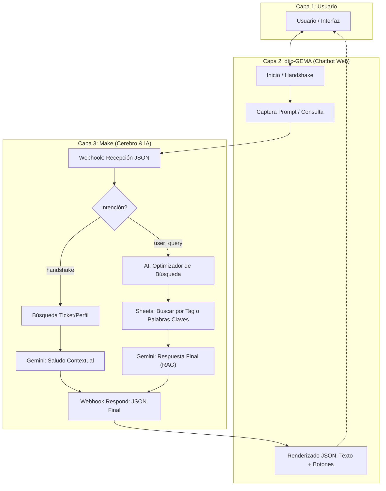

# 05. Arquitectura y Flujos de Trabajo

**Prioridad:** 05
**Última Actualización:** 2026-02-07

## 1. Arquitectura de 3 Capas

El sistema opera bajo una arquitectura de tres capas claramente definidas, donde la inteligencia y el procesamiento de datos se centralizan en la nube (Capa 3).

### Capa 1: Usuario (Interfaz Humana)
*   **Componente:** Navegador Web / Dispositivo Móvil.
*   **Responsabilidad:** Entrada de datos (texto/voz), visualización de respuestas y navegación por sugerencias.
*   **Identidad:** Verificada vía Google Identity.

### Capa 2: dtic-GEMA (Chatbot Web / Middleware)
*   **Componente:** `chatbot.js`, `index.html`, `styles.css`.
*   **Responsabilidad:** 
    *   Gestión de la interfaz de usuario (HUD).
    *   Orquestación del handshake de identidad.
    *   Parseo de respuestas JSON estructuradas.
    *   Renderizado de componentes dinámicos (botones de sugerencia).
    *   Renderizado de componentes dinámicos (botones de sugerencia).
    *   **Despliegue Dual:** El aplicativo GEMA (`www-dtic-gema`) reside en una carpeta aislada, separado físicamente del Portal de Documentación TPFI (Raíz), simulando un entorno de producción limpio.
### Capa 3: Make (Cerebro Interprete y Elaborador)
*   **Componente:** Blueprints de Make.com (v1.9+).
*   **Responsabilidad:**
    *   **Intérprete:** Reconocimiento de intención (`meta.intent`).
    *   **AI Optimizer:** Refinamiento de la consulta para acceso a base de conocimientos (RAG).
    *   **Buscador:** Recuperación de información desde la BD (Google Sheets).
    *   **Cerebro IA:** Generación de respuestas empáticas mediante Gemini.
    *   **Elaborador:** Construcción del contrato JSON final.

---

## 2. Diagrama de Flujo Completo (v1.9)

---

## 3. Principio de Funcionamiento
Toda la lógica "pesada" y la toma de decisiones reside en la **Capa 3**. La **Capa 2** debe ser lo más liviana posible (thin client), limitándose a presentar la información que el "Cerebro" le instruye a través del protocolo de comunicación.
