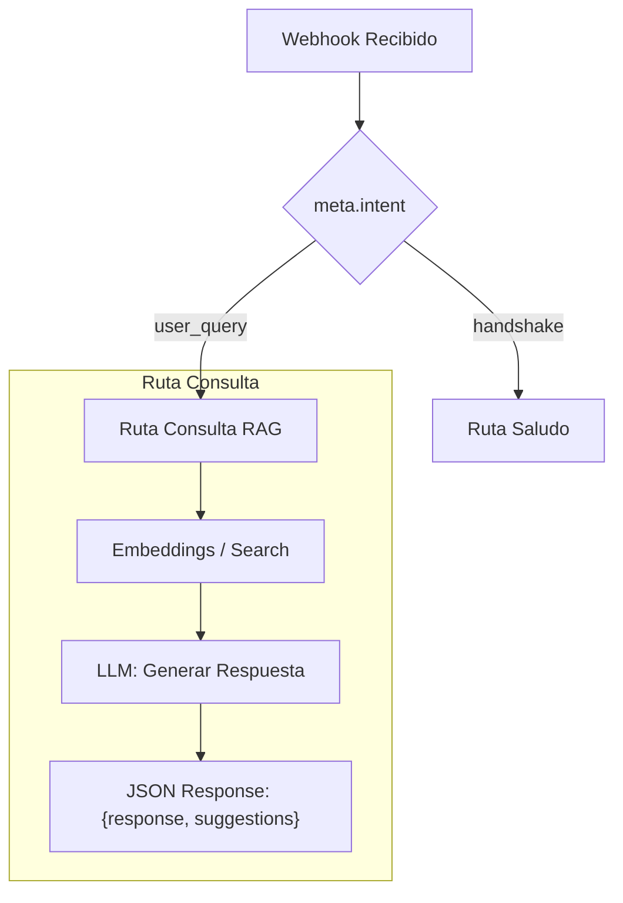
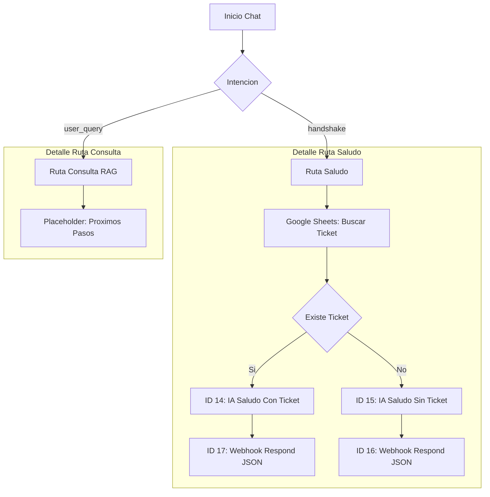

# Hito 1.9.3: Interacción Contextual Usuario-GEMA-MAKE

**Estado:** Terminado ✅
**Fecha Fin:** 2026-02-05

## Objetivo Técnico
Implementar un contrato de comunicación estricto basado en JSON entre el Frontend (GEMA) y el Backend (Make.com) para permitir:
1.  **Saludo Contextual:** Make sabe quién es el usuario y responde acorde a su historial.
2.  **Respuestas Estructuradas:** Make devuelve no solo texto, sino sugerencias de botones dinámicos.

## 1. Novedades y Estado del Hito

### Aciertos ✅
| Hora | Detalle |
| :--- | :--- |
| 21:10 | **Pivot:** Migración exitosa a Google Gemini (Native Make) para evitar bloqueos de API Vertex. |
| 21:45 | **Mapeo:** Corregidas referencias de Webhook Respond a los nuevos IDs de módulo (20 y 22). |
| 21:55 | **Validación E2E:** Pruebas superadas con éxito mediante `test-chatbot.sh`. |
| 16:00 | **Especificación Técnica:** Definido contrato estricto JSON (Request/Response) y diagrama de flujo. |
| 16:15 | **Frontend (`chatbot.js`):** Implementada detección y parseo de JSON (`{response, suggestions}`). |
| 16:20 | **Simulación:** Activado "Mock Mode" en local para probar renderizado de botones sin backend real. |
| 17:55 | **Datos Semilla:** Generado dataset de prueba (`app/data/datos_semilla_tickets.csv`) para poblar BD. |
| 18:05 | **Datos Usuarios:** Generado dataset complementario (`app/data/datos_semilla_usuarios.csv`) con legajos y roles. |
| 18:10 | **Datos Conocimiento:** Generado dataset RAG (`app/data/datos_semilla_conocimientos.csv`) para IA. |
| 18:35 | **Make Router:** Configurado filtro "Es Saludo Inicial" (`meta.intent = handshake`) para separar flujos. |
| 18:45 | **Make Sheets:** Pruebas unitarias exitosas del módulo de Búsqueda de Tickets. |
| 19:30 | **IA Prompt (Sherpa):** Configurado Mensaje 1 (Sistema) con identidad y reglas JSON. |
| 19:35 | **IA Prompt (Sherpa):** Configurado Mensaje 2 (Prompt) con mapeo de variables de Sheets. |
| 19:55 | **IA Prompts:** Finalizada configuración diferencial de Módulos 14 (Con Ticket) y 15 (Sin Ticket). |
| 20:05 | **Webhook Response:** Configurado Header `Content-Type: application/json` para renderizado. |
| 20:15 | **Blueprint v1.9.3.4:** Verificación exitosa de prompts, modelos, mapeos y headers. |
| 20:25 | **Arquitectura:** Documentado flujo actual con diagrama Mermaid. |
| 20:35 | **Test Script:** Refactodado `test-chatbot.sh` con menú interactivo y salida legible (Markdown/JSON). |
| 20:45 | **Test Script:** Añadido soporte para ejecución por parámetros (`./test-chatbot.sh 1`). |
| 20:55 | **Arquitectura (Pivot):** Decisión de migrar de Vertex AI a Google Gemini (AI Studio) por bloqueo de API 403. |

> [!IMPORTANT]
> **Resultado de Pruebas:**
> - **Test 1 (Con Ticket):** GEMA reconoce al usuario `Tester Alumno` y el ticket `TKY-1001`.
> - **Test 2 (Sin Ticket):** GEMA da bienvenida cordial a `Nuevo Visitante`.

> [!TIP]
> **Cambio de Rumbo:** Se adopta el módulo `Google Gemini` para evitar la complejidad de facturación de Google Cloud. Esto acelera el desarrollo y mantiene el mismo contrato JSON.

### Pendientes ⏳
| Prioridad | Tarea | Estado |
| :--- | :--- | :--- |
| - | (Ninguno - Hito Cerrado con v1.9.3.9) | ✅ Terminado |

### Próximos Pasos 🚀
| Orden | Acción |
| :--- | :--- |
| 1 | **Configurar Make:** Seguir la guía Sherpa para corregir los módulos 14, 15 y 16. |
| 2 | **Test Final:** Verificar que GEMA saluda con contexto real y botones. |
| 3 | **Cierre:** Documentar el éxito y cerrar el Hito 1.9.3. |

---

## 2. Detalles Técnicos y Contratos

### A. Contrato de Comunicación (API Spec)

#### Petición (Frontend -> Make)
El Webhook recibe un JSON con la siguiente estructura. El campo `meta.intent` es crítico para el enrutamiento.

```json
{
  "email": "usuario@ejemplo.com",
  "dni": "12345678",
  "session_id": "sess_x1y2z3",
  "user_name": "Juan Perez",
  "is_verified": true,
  "descripcion": "Mensaje del usuario o INIT",
  "meta": {
    "intent": "handshake"
  }
}
```

#### Respuesta (Make -> Frontend)
El Backend **DEBE** responder siempre con un JSON (`Content-Type: application/json`).

```json
{
  "response": "Texto principal que dirá el bot.",
  "suggestions": [
    "Sugerencia 1",
    "Sugerencia 2"
  ]
}
```

### B. Logica de Flujo (Mermaid)


### D. Diagrama de Flujo Actual (v1.9.3.4)



### E. Configuración Módulo Google Gemini (Native Make)

Para los módulos de IA (Con y Sin Ticket), configurar así:

*   **Model:** `gemini-1.5-flash-latest`
*   **System Instructions:** 
    > Eres dtic-GEMA v1.9. Tu salida DEBE ser un JSON con esta estructura: `{ "response": "...", "suggestions": [...] }`. No agregues texto fuera del JSON.
*   **Prompts (User):** 
    - *Caso Ticket:* `Contexto: Soy {{user_name}}. Ticket {{ID_Ticket}} ({{Estado}}). Salúdame y confirma que lo estamos gestionando.`
    - *Caso Nuevo:* `Contexto: Soy {{user_name}}. No tengo tickets. Dame una bienvenida cordial al DTIC.`
*   **Response Modalities:** `Text` únicamente.
*   **Google Search / Grounding / Code Execution:** Marcar todo como **No** o **Empty** (para evitar fallos de permisos).
    
### C. Implementación Frontend
1. **Detección de JSON:** `chatbot.js` intenta parsear la respuesta.

