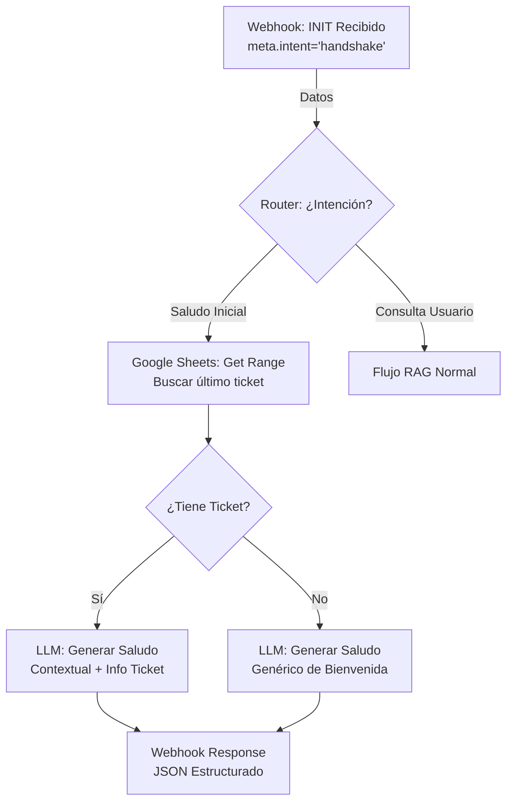

# Hito 1.9.3: Interacción Contextual Usuario-GEMA-MAKE (En Proceso)

**Fecha:** 2026-02-04
**Estado:** En Proceso 🚧

## Descripción
Mejorar la experiencia de inicio (Handshake) para que sea personalizada y contextual. GEMA no saludará de cero, sino que recordará el contexto previo si existe.

## Objetivo
"Hola [USUARIO], en cuanto a lo último que hicimos [CONTEXTO], te cuento que..." seguido de sugerencias relevantes.

## Estado del Hito

### Aciertos ✅
| Hora | Detalle |
| :--- | :--- |
| 22:30 | **Frontend Payload:** `chatbot.js` enriquecido con metadatos (`intent: handshake`, `timestamp`) para ruteo inteligente. |
| 23:20 | **Arquitectura:** Diagrama Mermaid Integrado (Ver abajo). |
| 23:50 | **Gestión de Archivos:** Blueprint movido a `app/data/`. |

### Pendientes ⏳
| Prioridad | Tarea |
| :--- | :--- |
| Alta | **Implementación Make:** Configurar Router, Sheets y LLM según especificación. |
| Alta | **Backend:** Validar respuesta JSON del LLM en Make. |
| Media | **Frontend:** Renderizar respuesta JSON estructurada (Saludo + Sugerencias). |

### Próximos Pasos 🚀
| Orden | Acción |
| :--- | :--- |
| 1 | **Continuar Sesión:** Implementar escenario en Make.com. |
| 2 | **Validar:** Probar flujo con JSON de prueba. |

## 📐 Especificación de Flujo (Make.com)

**Diagrama de Flujo:**


Este flujo debe configurarse manualmente en la interfaz de Make.com.

### 1. Trigger (Webhook)
- **Entrada:** Recibe el JSON enriquecido del Frontend.
- **Dato Clave:** `meta.intent` (puede ser `handshake` o `user_query`).

### 2. Router (Decisor)
Crea un "Router" conectado inmediatamente después del Webhook.

#### Ruta A: "Saludo Inicial" (Inicio de Sesión)
**Condición:** `meta.intent` = `handshake` (o `descripcion` = `INIT` para retrocompatibilidad).
1.  **Google Sheets (Get Range/Search):**
    -   Buscar en hoja "Tickets" donde `Email` coincida con `payload.email`.
    -   Orden: Descendente (más reciente primero).
    -   Límite: 1.
    -   *Objetivo:* Saber en qué quedó lo último que habló el usuario.
2.  **LLM (Gemini/OpenAI) - Generador de Saludo:**
    -   **Prompt:** "El usuario {{name}} acaba de entrar. Su último ticket fue {{ticket_info}}. Genera un saludo corto y cálido de bienvenida (máximo 2 líneas). Si el ticket sigue abierto, menciónalo sutilmente."
3.  **Webhook Response:**
    -   Devolver JSON:
        ```json
        {
          "response": "¡Hola Juan! Veo que tu consulta del WiFi sigue en proceso...",
          "suggestions": ["Estado de mi ticket", "¿Cómo crear un usuario?", "Hablar con un humano"]
        }
        ```

#### Ruta B: "Consulta Usuario" (Consulta Normal)
**Condición:** `meta.intent` != `handshake`.
-   Mantener el flujo actual (RAG, búsqueda de conocimiento, respuesta estándar).
