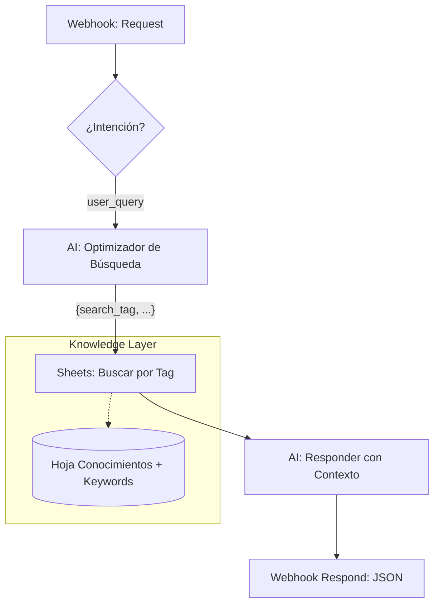

# Hito 1.9.4: Consultas de Usuario y RAG (Knowledge Base)

**Estado:** Finalizado ✅
**Fecha Fin:** 2026-02-05

## Objetivo Técnico
Habilitar la capacidad de GEMA para responder preguntas factuales consultando una base de conocimientos dinámica en Google Sheets, utilizando un patrón **RAG (Retrieval Augmented Generation)**.

## 1. Novedades y Auditoría de Feedback
Este hito se cierra con la versión del blueprint **v1.9.3.9**, la cual fue validada contra el feedback del evaluador.

### Completados ✅
- [x] **Arquitectura de IA Universal:** Se eliminaron las respuestas estáticas en ramas de error. Ahora tanto usuarios registrados como invitados reciben respuestas generadas por Gemini.
- [x] **RAG Flow v2 (Rama 2):** Implementación de Módulos [24], [23] y [25] con optimización de búsqueda por Tags y respuesta final procesada por IA.
- [x] **Corrección de Mapeos:** Se solucionaron los errores de "Accepted" asegurando que el Webhook [26] use la salida de la IA [25].
- [x] **Refinamiento de Tono:** Integración de instrucciones de sistema para un tono empático y profesional.

### Feedback del Evaluador (Incorporado) 🎓
> El evaluador señaló una contradicción lógica en la v1.9 donde la IA estaba en la rama de "Error" y no en la "Happy Path". 
> **Acción:** Se reestructuró el blueprint v1.9.3.9 moviendo los módulos de Gemini al inicio de cada rama de respuesta, garantizando que el "alma" del chatbot sea siempre la IA.

## 2. Detalles de Ingeniería y Contratos

### Arquitectura de la Rama 2 (RAG Flow v2)

### Especificación de Módulos

#### Módulo [23] - AI Optimizador
- **Input:** `{{3.text}}`
- **Output (JSON):** `{ "search_tag": "WIFI", "optimized_query": "contraseña wifi" }`.

#### Módulo [24] - Google Sheets: Search Rows
- **Lógica Maestro/Esclavo:**
    1. **Preferencia:** Búsqueda por `Tag` (Exacto).
    2. **Fallback:** Búsqueda por `Palabras_Clave` (Contiene).
- **Salida:** `{{24.Respuesta_Estandar}}`.

#### Módulo [25] - AI Responder
- **Prompt:** Usa `{{24.Respuesta_Estandar}}` para redactar el mensaje final al usuario.

---
> [!NOTE]
> Este hito permite que GEMA deje de ser solo un "saludador" y empiece a ser un asistente útil con información real.
