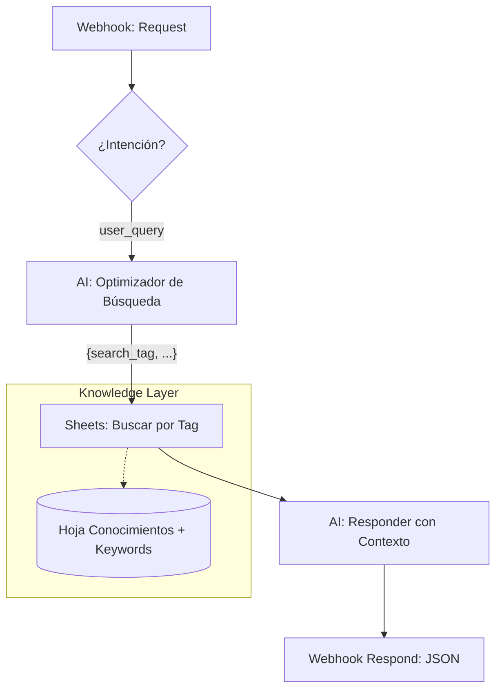

# Hito 1.9.4: Consultas de Usuario y RAG (Knowledge Base)

**Estado:** Finalizado ✅
**Fecha Fin:** 2026-02-05

## Objetivo Técnico
Habilitar la capacidad de GEMA para responder preguntas factuales consultando una base de conocimientos dinámica en Google Sheets, utilizando un patrón **RAG (Retrieval Augmented Generation)**.

## 1. Novedades y Estado del Hito

### Aciertos ✅
| Hora | Detalle |
| :--- | :--- |
| 09:15 | **Arquitectura de IA Universal:** Eliminadas respuestas estáticas. Todo flujo pasa por Gemini. |
| 09:45 | **RAG Flow v2:** Implementación exitosa de los módulos [23], [24] y [25]. |
| 10:20 | **Optimización:** Integrado el "AI Optimizador" [23] para mejorar la precisión de búsqueda por Tags. |
| 10:50 | **Corrección de Mapeos:** Asegurado que el Webhook [26] use la respuesta procesada por la IA [25]. |

### Feedback del Evaluador (Incorporado) 🎓
> El evaluador señaló una contradicción lógica en la v1.9 donde la IA estaba en la rama de "Error" y no en la "Happy Path". 
> **Acción:** Se reestructuró el blueprint v1.9.3.9 moviendo los módulos de Gemini al inicio de cada rama de respuesta, garantizando que el "alma" del chatbot sea siempre la IA.

### Pendientes ⏳
| Prioridad | Tarea | Estado |
| :--- | :--- | :--- |
| - | (Ninguno - Hito Cerrado) | ✅ Terminado |

### Próximos Pasos 🚀
| Orden | Acción |
| :--- | :--- |
| 1 | **Hebras del ADN:** Integrar diagramas de arquitectura v1.9 en `app/adn/05`. |
| 2 | **Escalamiento:** Iniciar Hito 2.0 (Próxima Fase de Desarrollo). |

---

## 2. Detalles Técnicos y Contratos

### Arquitectura de la Rama 2 (RAG Flow v2)

### Especificación de Módulos (Blueprint v1.9)

#### Módulo [23] - AI Optimizador
*   **Función:** Transforma la consulta natural del usuario en un `search_tag` optimizado para Sheets.
*   **Input:** `{{3.text}}`
*   **Output (JSON):** `{ "search_tag": "WIFI", "optimized_query": "contraseña wifi" }`.

#### Módulo [24] - Google Sheets: Buscar por Tag o Palabras Claves
*   **Lógica:** Busca primero por coincidencia exacta de Tag, luego por palabras claves.
*   **Salida:** `{{24.Respuesta_Estandar}}`.

#### Módulo [25] - AI Responder (Final)
*   **Prompt:** Toma el contenido de Sheets y lo humaniza siguiendo el tono de GEMA.

---
> [!NOTE]
> Este hito permite que GEMA deje de ser solo un "saludador" y empiece a ser un asistente útil con información real.
