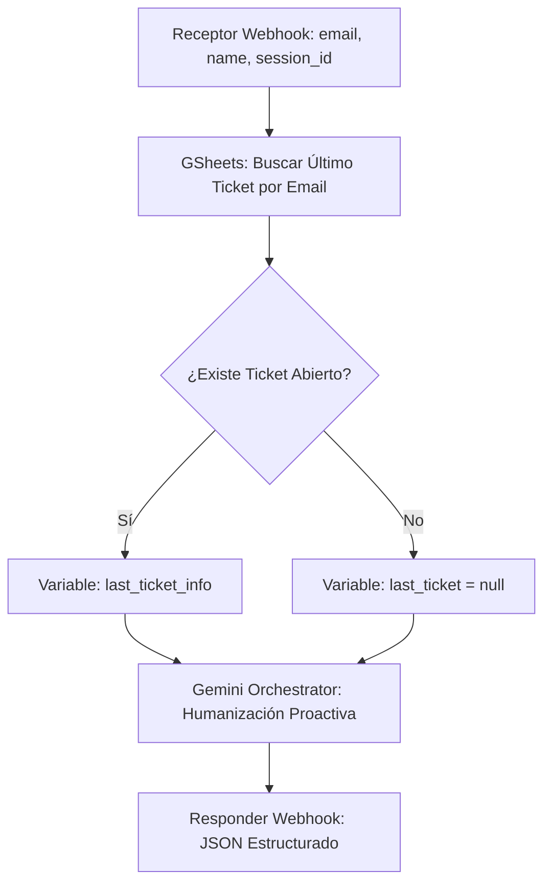

# Especificación de Refactor Blueprint v1.9.4: GEMA Proactiva

Esta especificación describe el flujo lógico que debe tener el escenario en Make.com para cumplir con los estándares de la versión 1.9.

## 📐 Diagrama de Flujo Lógico



## 🛠️ Detalles de los Módulos

### 1. Receptor (ID 3)
- El payload ahora incluye: `email`, `user_name`, `is_verified`, `session_id`, `descripcion`.

### 2. Buscador de Historial (NUEVO)
- **Módulo**: `Google Sheets: Search Rows`.
- **Hoja**: `Tickets`.
- **Filtro**: `Email (C) == {{3.email}}`.
- **Sort Order**: Descending (Fecha).
- **Limit**: 1.

### 3. Orquestador Gemini (ID 11) - Refactor
- **Inyección de Prompt**:
  ```markdown
  Usuario: {{3.user_name}} (Verificado: {{3.is_verified}})
  Último Ticket: {{B.ID_Ticket}} - {{B.Estado}} - {{B.Consulta}}
  Mensaje Actual: {{3.descripcion}}
  ```
- **Instrucción**: Usar los datos del último ticket para el saludo proactivo si el estado no es "Resuelto".

### 4. Responder (ID 7) - Refactor
- **Body (JSON)**:
  ```json
  {
      "response": "{{11.text}}",
      "meta": {
          "user": "{{3.user_name}}",
          "intent": "atencion_personalizada",
          "proactive": {{C.exists}}
      }
  }
  ```

---
> [!IMPORTANT]
> Este diseño asegura que GEMA se anticipe a las necesidades del usuario, logrando el efecto "WOW" solicitado.

---
> [!TIP]
> Esta estructura permitirá que GEMA "recuerde" lo que se habló hace dos mensajes dentro de la misma sesión.
